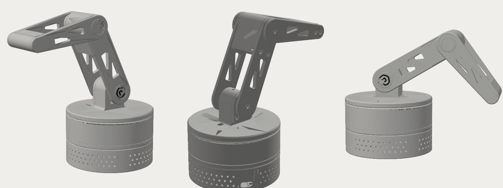

# wavearm

base turns, shoulder and elbow tilt. a raspberry pi 5 lives in the base, your mac webcam tells it what to do.

## files

- `arm3.py` the design. every size is a variable at the top, change one and rerun `python3 arm3.py`
- `print/*.stl` print ready, already on their flat faces, no supports anywhere
- `print/*.step` open in fusion 360 / onshape / autocad (IMPORT)
- `print/arm3_assembly.step` everything put together with dummy servos and the pi
- `check3.py` checks nothing collides. passes for shoulder and elbow anywhere in +-90 (the servos full range)
- `software/` arm copying + head tracking, see software/README.md

## parts (about $40 at altronics)

| part | code | price |
|---|---|---|
| [MG90S metal servo](https://www.altronics.com.au/product/z6444-mg90s-metal-geared-micro-servo) (shoulder) | Z6444 | $13.95 |
| 9g plastic servo x2 (base, elbow) | Z6392 | $9.95 each |
| pin to socket jumper strip | P1021 | $4.00 |
| M3x10 screws, 25 pack | H3120A | $2.60 |
| raspberry pi 5 + official 27W power supply | | already had |
| microSD card, 16-32gb | | ~$10 anywhere but altronics |

12x M3x10 total. the pi sits on printed pegs, no M2.5 screws needed.

## wiring

| servo | signal | 5V | GND |
|---|---|---|---|
| base | pin 32 (GPIO 12) | pin 2 | pin 6 |
| shoulder | pin 33 (GPIO 13) | pin 4 | pin 14 |
| elbow | pin 12 (GPIO 18) | shares pin 2 or 4 | pin 9 |

## a1 mini plates (print/a1mini/)

- `plate0_servo_gauge` push each servo into the slots, the tightest one it slides into is its size. tell me the numbers before printing plates 2 to 4
- `plate1_tray_plus` tray + servo cover + elbow cap (25% infill). safe to print now
- `plate1_tray` tray on its own
- `plate2_drum`, `plate3_shoulder`, `plate4_arm` wait for the servo sizes. brim on for plate 4
- `plate5_small` ring + cover + both caps. pause at 1.6mm for the logo colour

## print list (bambu light grey PLA, 0.2mm, 3 walls, 15% gyroid)

| part | notes |
|---|---|
| tray | the pi bay, 25% infill so the base is heavy |
| drum | lid of the tray, holds the base servo |
| ring | print in white or translucent PLA if you add an led later, grey is fine otherwise |
| shoulder | platter + shoulder tower, one piece |
| cover | clamps the shoulder servo in |
| up_front, up_back | upper arm |
| fo_front, fo_back | forearm |
| cap_shoulder + cap_shoulder_logo | two colours, or a filament change at 1.6mm |
| cap_elbow | |

print `cap_elbow` first and check it presses into the forearm. if its loose or tight, change the 0.15 next to `CAP_D`.

## build order

1. measure your servos and fix the `S_` numbers at the top of arm3.py (the plastic ones are slightly smaller, the pockets have room for both)
2. centre all three servos at 90 degrees before any horn goes on
3. pi onto the pegs in the tray, usb-c lined up with the port at the back
4. base servo into the drums cradle, two tab screws. drum onto the tray, 4x M3x10 from underneath
5. ring into the drum, base servo horn into the pocket under the platter, platter onto the spline, horn screw through the hole in the top of the tower
6. shoulder servo into the tower from the back, cover on (2x M3x10)
7. elbow servo into the housing at the top of up_front, horn on the outside. up_back on (2x M3x10 into the housing, M3x10 into the shoulder boss as the pivot)
8. forearm: horn into the pocket in fo_front, push onto the elbow spline, horn screw. fo_back on (2x M3x10 at the tip, M3x10 into the elbow as the pivot, snug not tight)
9. press both caps in

12x M3x10 total, one 25 pack covers it.

## older versions

`v1/` has the first 2 joint waving arm (esp32 and pi versions). the 3 joint arm replaced it.
