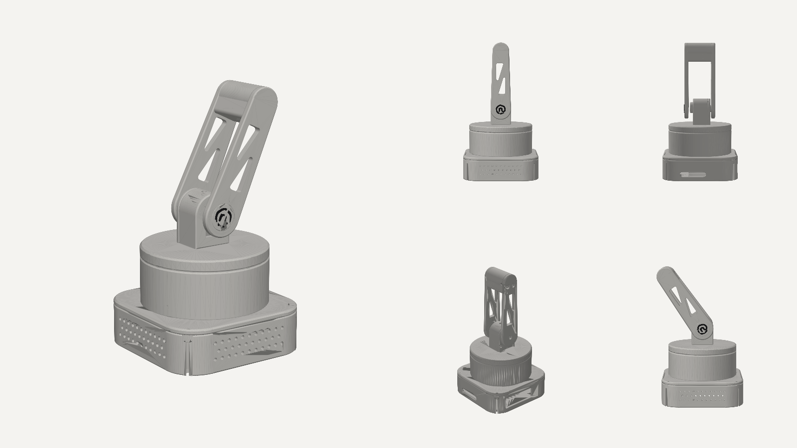

# wave arm

two joint desk arm. the drum turns to face you, the link swings side to side to wave. a raspberry pi 5 lives in the base, so it runs on its own (camera, face tracking, sprout) with no laptop.

## files

- `wavearm.py` the actual design. every size is a variable at the top, change one and rerun `python3 wavearm.py`
- `out/*.step` open these in fusion 360, onshape or autocad (IMPORT) to look around and edit
- `out/wave_arm_assembly.step` everything put together, with dummy servos and the pi in place
- `out/*.stl` already in print orientation, drag straight into bambu studio
- `check.py` checks nothing collides across the whole swing (including the pi in the tray)
- `software/` head tracking: mac webcam finds you, pi moves the arm (see software/README.md)
- `wavearm_esp32.py` the older version with a tiny esp32 board in the drum instead of a pi

## parts list (about A$55 at altronics)

- raspberry pi 5 (already have) + its active cooler + the official 27W usb-c power supply. a weaker charger will make it reboot when the servos move
- 3x MG90S micro servo (2 + 1 spare). altronics Z6444
- male to female jumper wires (servo plug to pi pins)
- M3 button head screws: 4x M3x8 (tray to drum), 2x M3x10 (cover), 1x M3x8 (rear pivot), 2x M3x12 (link)
- 4x M2.5x6 screws for the pi
- 4x 10mm rubber feet
- optional: 470uF capacitor + mini breadboard if the pi reboots when servos start

## printing

- PLA, matte light grey looks closest to the reference. 0.2mm layers, 3 walls, 15% gyroid. tray at 25% so it's heavier
- the tray and the drum are separate prints (tray open side up, drum on its flat lid)
- no supports on anything, every part already sits on its flat face
- hub cap: print `cap.stl` + `cap_logo.stl` together as two colours (AMS), or print `cap_onepiece.stl` and add a filament change at 1.6mm
- print `cap.stl` first and check it presses into the link. if it's loose or tight, change the 0.15 next to `CAP_D` in the code

## build order

1. measure your servos with calipers and fix the `S_` numbers at the top of `wavearm.py` before printing anything big
2. centre both servos at 90 degrees before any horn goes on (one line of code). if you skip this the arm waves lopsided
3. pi into the tray: usb + ethernet at the back opening, 4x M2.5 into the standoffs. servo 1 drops into the cradle in the drum, shaft up, two tab screws. its cable goes out the side slot and down the hole in the drum floor. drum onto the tray, 4x M3x8 up from underneath
4. screw servo 1's horn into the pocket under the platter, push the platter onto the spline, then put the horn screw in from above through the little hole in the top of the tower
5. thread servo 2's cable down the slot in the tower floor, slide the servo in from the back, shaft forward. the cover clamps it, 2x M3x10
6. horn into the pocket on the back of the front link, push onto servo 2's spline, horn screw in. back plate on with 2x M3x12 into the bridge, M3x8 into the rear boss (snug, not tight, it's a pivot)
7. press the hub cap in

## wiring (no soldering)

| servo wire | base servo | shoulder servo |
|---|---|---|
| red (5V) | pin 2 | pin 4 |
| brown (GND) | pin 6 | pin 14 |
| orange (signal) | pin 32 (GPIO 12) | pin 33 (GPIO 13) |

- GPIO 12 and 13 are hardware PWM on the pi 5, so the servos dont jitter. normal software PWM makes them twitch
- the pi gets power through the side slot (usb-c, the plug reaches in about 13mm). hdmi is in the same slot if you ever need a screen

## numbers

- shoulder pivot 103mm up, arm tip 203mm up, footprint 112mm square
- link swings ±90 degrees without hitting anything (`python3 check.py`)
